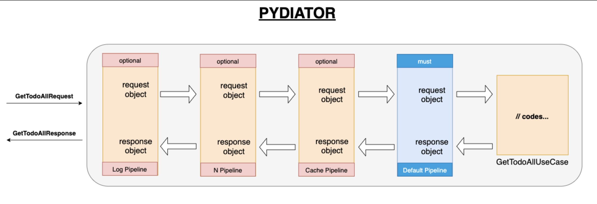

# What is the pydiator?
Pydiator is an in-app communication method. 

It provides that developing the code as an aspect. Also, it supports clean architecture infrastructure

It is using design patterns such as chain of responsibility, mediator, singleton.

Pydiator provides which advantages to developers and project?
* Is testable
* Has Use case support
* Has Aspect programming (Authorization, Validation, Cache, Logging, Tracer etc.) support
* Has Clean architecture support
* Expandable architecture via pipeline
* Is independent framework
 

 
# How it works? 
Pydiator knows 3 object types. 
These are;

1- **Request object** 
   * is used for calling the use case.
   * it should be inherited from **BaseRequest**
   ```python 
    class GetSampleByIdRequest(BaseRequest):
        def __init__(self, id: int):
            self.id = id
   ```
   * this object is sent to use case via pydiator
   ```python
    pydiator.send(SampleRequest(id=1))
   ```

2- **Use Case**
   * includes logic codes
   * it should be inherited from **BaseHandler**  


# How to set up pydiator?

```python
# get_by_id_handler

from pydiator_core.interfaces import BaseRequest, BaseResponse, BaseHandler


class GetByIdRequest(BaseRequest):
    def __init__(self, id: int):
        self.id = id


class GetByIdResponse(BaseResponse):
    def __init__(self, id: int, title: str):
        self.id = id
        self.title = title


class GetByIdUseCase(BaseHandler):
    async def handle(self, req: GetByIdRequest):
        # related codes are here such as business
        return GetByIdResponse(id=req.id, title="hello pydiatr")


import asyncio
from pydiator_core.mediatr import pydiator
from pydiator_core.mediatr_container import MediatrContainer


def set_up_pydiator():
    container = MediatrContainer()
    container.register_request(GetByIdRequest, GetByIdHandler())
    pydiator.ready(container=container)


if __name__ == "__main__":
    set_up_pydiator()
    loop = asyncio.new_event_loop()
    response: GetByIdResponse = loop.run_until_complete(pydiator.send(GetByIdRequest(id=1)))
    loop.close()
    print(response.to_json())


```

# How to run the Unit Tests
`install tests/requirements.txt`

`pytest tests/`

